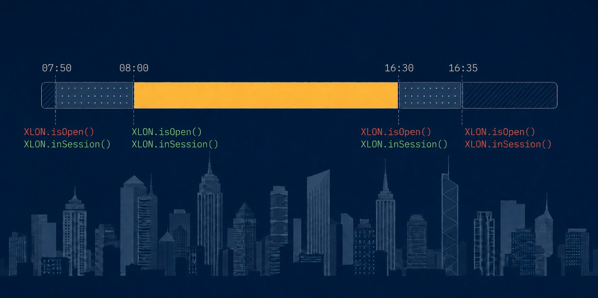

# market-hours



[](https://github.com/tickerfinance/market-hours/actions/workflows/ci.yml)
[](https://github.com/tickerfinance/market-hours/actions/workflows/runtimes.yml)
[](#tests)
[](https://www.npmjs.com/package/market-hours)
[](https://www.npmjs.com/package/market-hours)
[](#typescript)
[](package.json)
[](#size)
[](LICENSE)

Trading hours, bank holidays and early closes for financial venues. Zero dependencies, ESM and
CommonJS, and no network access at runtime.

```ts
import { XLON } from 'market-hours/xlon';

XLON.isOpen(); // now
XLON.isOpen('2026-12-24T14:00:00Z'); // false — Christmas Eve closes early
XLON.getStatus().phase; // 'pre-open-auction' | 'open' | 'closing-auction' | 'closed'
XLON.nextOpen(); // Date
```

## Features

- **Testable.** Every function takes an optional instant, so asserting on a bank holiday is a line
  of code rather than a fake timer.
- **Host-independent.** Answers come from `Intl` and civil-date arithmetic. No `getHours`, no
  `toLocaleString` round-trip, no dependence on the machine's own time zone.
- **Auctions are modelled.** `isOpen` is the continuous order book; `inSession` includes opening and
  closing auctions.
- **Real calendar data.** Holidays and early closes ship as plain JSON, one file per venue, readable
  without running any of this code.
- **Refuses rather than guesses.** Outside the verified calendar, or on a runtime whose time-zone
  data cannot be trusted, it throws instead of returning a plausible answer.
- **Tree-shakeable.** Venues are separate modules; a bundler drops the ones you never import.
- **Zero dependencies**, ESM + CommonJS, types for both.

## Install

```sh
npm install market-hours
```

```ts
import { XLON } from 'market-hours/xlon'; // ESM
const { XLON } = require('market-hours/xlon'); // CommonJS
```

## Venues

Two kinds, because they have different phases.

|                  | Identifier    | Phases                                                  | Build your own    |
| ---------------- | ------------- | ------------------------------------------------------- | ----------------- |
| **Exchange**     | ISO 10383 MIC | `closed`, `pre-open-auction`, `open`, `closing-auction` | `defineMarket()`  |
| **News service** | Service code  | `closed`, `open`                                        | `defineService()` |

Shipped today:

| Import              | Venue                   | Hours                             |
| ------------------- | ----------------------- | --------------------------------- |
| `market-hours/xlon` | London Stock Exchange   | 07:50 auction, 08:00–16:30, 16:35 |
| `market-hours/rns`  | Regulatory News Service | 07:00–19:30                       |

Each module exports the venue, ready to query, and the calendar behind it:

```ts
import { XLON, XLON_CALENDAR } from 'market-hours/xlon';
import { RNS } from 'market-hours/rns';

// The newswire is still running after the order book has shut.
XLON.isOpen('2026-01-15T18:00:00Z'); // false
RNS.isOpen('2026-01-15T18:00:00Z'); // true
```

There is no `getMarket('XLON')` lookup. A string-keyed registry has to reference every calendar it
can name, so asking about one venue would bundle all of them. An imported venue is a single instance
for the whole process and shares its day-schedule cache; nothing else about it is stateful.

## Two conventions worth reading first

**Sessions are half-open, `[start, end)`.** The start is included, the end excluded, compared on
epoch milliseconds.

> On an ordinary London day, **16:29:59.999 is `open`** and **16:30:00.000 is `closing-auction`**.

Every instant belongs to exactly one phase and adjacent sessions tile the day, so there is no
boundary at which a venue is in two phases or none. If you poll on a fixed interval, a tick landing
exactly on a session's `end` is outside it.

**An instant string with no offset is UTC.** `'2026-12-24T09:00'` means 09:00 UTC, never the host's
local time. But where a **date** is accepted — `getSchedule`, `isTradingDay`, `covers` — a
`'YYYY-MM-DD'` string is that civil date **in the venue's own time zone**:

```ts
XLON.isTradingDay('2026-06-10'); // true  — a civil date in London
XLON.isOpen('2026-06-10'); // false — an instant, midnight UTC
```

Both are correct. Anything unparseable throws rather than becoming `Invalid Date`.

## API

### `venue.isOpen(at?) → boolean`

Continuous trading only. The closing auction is **not** open.

```ts
XLON.isOpen('2026-01-15T16:32:00Z'); // false — in the closing auction
XLON.inSession('2026-01-15T16:32:00Z'); // true
```

### `venue.inSession(at?) → boolean`

True during any live phase, auctions included.

### `venue.isTradingDay(date?) → boolean`

Whether the venue trades at all that day.

### `venue.getStatus(at?) → Status`

```ts
{
  venueId: 'XLON',
  at: Date,                 // the instant evaluated
  localDate: '2026-12-24',  // civil date in the venue's zone
  localTime: '12:29:59.999',
  phase: 'open',
  isOpen: true,
  inSession: true,
  holiday: null,            // the holiday's name when closed for one
  currentSession: { phase: 'open', start: Date, end: Date } | null,
}
```

Answers only about the instant you gave it. For what happens next, call `nextTransition()`.

### `venue.getSchedule(date?) → DaySchedule`

The day's sessions, plus `dayStart` and `dayEnd` — the first session's start and the last one's end,
or `null` on a non-trading day.

```ts
XLON.getSchedule('2026-12-24').dayEnd; // 2026-12-24T12:35:00.000Z
```

Prefer `dayEnd` to reaching into `sessions`: it contracts by itself on a short day, so padding
derived from it needs no clock time written down.

They are not called `open`/`close` because an exchange opens in stages — `dayStart` is the opening
auction, before the phase called `open`. For continuous trading specifically:

```ts
const day = XLON.getSchedule('2026-12-24');
const trading = day.sessions.find((session) => session.phase === 'open')?.start;
```

### `venue.nextTransition(at?) → Transition`

The next instant the phase changes, with the phases either side. Always strictly in the future.

### `venue.nextOpen(at?) → Date` · `venue.nextClose(at?) → Date`

The next instant continuous trading starts or ends, skipping weekends and holidays.

```ts
// Friday after the close; the following Monday is a bank holiday.
XLON.nextOpen('2026-05-01T17:00:00Z'); // 2026-05-05T07:00:00.000Z
```

### `venue.covers(date) → boolean` · `venue.getCoverage() → Coverage`

Whether the calendar covers a date — meaning queries about it will answer rather than throw — and
the verified range with its sources.

Assert on it at **deploy time or in CI**, not at startup: a long-lived serverless process has no
startup that knows the time.

```ts
const horizon = new Date(Date.now() + 365 * 86_400_000)
  .toISOString()
  .slice(0, 10);
if (!XLON.covers(horizon)) {
  throw new Error('market-hours calendar expires within a year');
}
```

A forward-looking call can still reach past the horizon from a covered date: `nextOpen` on the last
covered Friday asks about an uncovered Monday.

### `defineMarket(data)` · `defineService(data)`

For a venue this package does not ship, or one it does whose calendar you need to change.

```ts
import { defineMarket } from 'market-hours';

const xnys = defineMarket({
  id: 'XNYS',
  type: 'exchange',
  name: 'New York Stock Exchange',
  timeZone: 'America/New_York',
  weekend: [0, 6],
  sessions: [{ phase: 'open', start: '09:30', end: '16:00' }],
  coverage: { from: '2026-01-01', through: '2026-12-31' },
  sources: [{ what: 'Holidays', url: '…', licence: '…', retrievedAt: '…' }],
  holidays: [{ date: '2026-07-03', name: 'Independence Day (observed)' }],
  earlyCloses: [
    {
      date: '2026-11-27',
      sessions: [{ phase: 'open', start: '09:30', end: '13:00' }],
    },
  ],
});
```

Spread a shipped calendar to extend or correct it:

```ts
import { XLON_CALENDAR } from 'market-hours/xlon';

const lse = defineMarket({
  ...XLON_CALENDAR,
  coverage: { from: XLON_CALENDAR.coverage.from, through: '2030-12-31' },
  holidays: [
    ...XLON_CALENDAR.holidays,
    { date: '2029-12-25', name: 'Christmas Day' },
  ],
});
```

Hold the result at module scope — it caches its own day schedules, and two calls make two venues.
To contribute a venue so everyone gets it, add a `data/` file: see
[docs/adding-a-venue.md](docs/adding-a-venue.md).

### Time-zone primitives

Exported deliberately, because a correct wall clock is what people reach for `toLocaleString` to
get.

```ts
import {
  toZonedParts,
  fromZonedParts,
  getTimeZoneOffsetMs,
} from 'market-hours';

toZonedParts('2026-07-15T10:30:00Z', 'Europe/London'); // { hour: 11, minute: 30, offsetMs: 3600000, … }
fromZonedParts({ year: 2026, month: 7, day: 15, hour: 11 }, 'Europe/London');
getTimeZoneOffsetMs('Europe/London', '2026-07-15T10:30:00Z'); // 3600000
```

`fromZonedParts` takes a `disambiguation` option — `'compatible'` (the default, matching Temporal),
`'earlier'`, `'later'` or `'reject'` — for the hour that repeats when clocks go back and the hour
that is skipped when they go forward.

### Errors

Every error is a `MarketHoursError` with a stable `code`. Match on the code, not the message.

```ts
import { isMarketHoursError } from 'market-hours';

try {
  XLON.isOpen('2099-12-25T12:00:00Z');
} catch (error) {
  if (isMarketHoursError(error)) error.code; // 'CALENDAR_HORIZON'
}
```

`CALENDAR_HORIZON` · `INVALID_INSTANT` · `INVALID_DATE` · `INVALID_TIME_ZONE` ·
`TIME_ZONE_UNAVAILABLE` · `AMBIGUOUS_LOCAL_TIME` · `NONEXISTENT_LOCAL_TIME` · `NO_TRANSITION_FOUND` ·
`INVALID_VENUE_DEFINITION`

Use `isMarketHoursError` rather than `instanceof`: a bundle can contain both the ESM and CommonJS
copies of the class, and `instanceof` fails across that boundary.

## Calendar coverage

Holidays are verified from **2019-01-01 through 2028-12-31**; `getCoverage()` reports the current
range at runtime. **Outside it, queries throw `CALENDAR_HORIZON`** rather than inventing holidays.

A release each month extends the range, and CI here fails once coverage drops below six months
ahead, so a current install always has room. `error.details.side` is `'before'` or `'after'`:
upgrading only ever extends the upper end, so a historical backfill needs its own calendar rather
than a newer release.

## Runtimes without time-zone data

Some engines ship `Intl` without IANA time-zone data, and some accept a zone name and then silently
format in UTC — which would make every answer an hour wrong for part of the year without raising
anything. This package runs a known-answer probe rather than trusting `typeof Intl`, and throws
`TIME_ZONE_UNAVAILABLE` instead of returning a wrong answer.

```ts
import { getTimeZoneSupport } from 'market-hours';

const support = getTimeZoneSupport('Europe/London');
if (!support.supported) {
  // support.reason: 'no-intl' | 'no-time-zone-support' | 'incorrect-offsets'
  console.warn(support.detail);
}
```

## Compatibility

| Target                       | Status                                                                                     |
| ---------------------------- | ------------------------------------------------------------------------------------------ |
| Node 20 · 22 · 24            | Full suite in CI, under 8 host time zones                                                  |
| Node 18                      | Published tarball installed and exercised, ESM and CommonJS                                |
| Cloudflare Workers (workerd) | Full unit suite runs in workerd                                                            |
| Bun · Deno                   | Published package installed and used each release                                          |
| Chromium · Firefox · WebKit  | Core suite runs in-browser                                                                 |
| AWS Lambda                   | Supported — it is Node. Not separately tested                                              |
| React Native / Hermes        | Only where the engine provides `Intl` with IANA data. Not device-tested; probe first       |
| Bundlers                     | `publint` and `@arethetypeswrong/cli` clean for node10, node16-cjs, node16-esm and bundler |

### TypeScript

Typechecked from **4.8** to **latest** across four consumer `tsconfig` shapes — classic
`moduleResolution: node`, `node16` CommonJS, `bundler` with `verbatimModuleSyntax`, and an `es5`
target — each on the versions where its configuration is legal.

### Tests

The suite runs under eight host time zones, including a 45-minute offset, a zone whose DST step is
30 minutes, and one on the far side of the date line. Coverage thresholds are enforced in CI at 100%
of statements, functions and lines.

## Size

Measured with esbuild, minified:

| Imported               | Bundle  | Gzipped |
| ---------------------- | ------- | ------- |
| `XLON`                 | 19.7 kB | 6.1 kB  |
| `XLON` + `RNS`         | 21.0 kB | 6.2 kB  |
| `XLON_CALENDAR` (data) | 6.9 kB  | 1.1 kB  |

A second venue costs 1.3 kB because bank holidays are shared per jurisdiction rather than copied per
venue, and a venue you never import costs nothing. The last row is a data-only import dropping the
engine entirely; CI checks it stays that way.

## Performance

Node 24, 200,000 calls each, instants spread across a year. Reproduce with
`node scripts/measure-performance.mjs`.

| Call             | Per call |
| ---------------- | -------- |
| `isOpen`         | 2.9 µs   |
| `getStatus`      | 2.7 µs   |
| `getSchedule`    | 2.6 µs   |
| `nextTransition` | 7.7 µs   |

The first call to a venue costs about 10 ms while `Intl` builds its formatter for that zone; every
call after it reuses the formatter. Day schedules are cached, so the remaining ~3 µs is
`Intl.formatToParts` resolving your instant to a civil date.

## What this does not model

- **Intraday halts and suspensions**, and **ad-hoc same-day closures.** Live events, not calendar
  data.
- **Auction extensions.** A price-monitoring extension adds five minutes to a call and can repeat,
  so an individual security's closing auction may run past the scheduled end. Extension behaviour is
  a per-instrument parameter, so no venue-level clock time is correct for every security. To cover
  the tail, pad from `getSchedule().dayEnd`.
- **Settlement and clearing calendars.**

## Provenance

Calendar data lives in [`data/`](data) as plain JSON and ships in the published package, so it can be
read and checked without running any of this code, or from another language.

```
data/
  jurisdictions/   england-and-wales.json   bank holidays, shared between venues
  exchanges/       XLON.json                sessions, early closes
  news-services/   RNS.json
```

**Bank holidays** come from [`gov.uk/bank-holidays.json`](https://www.gov.uk/bank-holidays.json),
`england-and-wales` division — public sector information licensed under the
[Open Government Licence v3.0](https://www.nationalarchives.gov.uk/doc/open-government-licence/version/3/).

**XLON session times** are transcribed from the London Stock Exchange's published trading-day
timetable; early closes on 24 and 31 December are entered by hand from the exchange's calendar,
which the gov.uk feed does not publish.

**RNS hours are observed, not official.** No public source states the service's opening hours as a
clock window. The 07:00–19:30 window and the 13:30 early close are derived from release timestamps
of published RNS announcements over 2019–2026, excluding the service's own daily `Service Notice`
items. Treat them as a well-evidenced envelope rather than a published timetable.

Sources are also available at runtime via `getCoverage().sources`, so attribution travels with the
data.

## Versioning

- **major** — an export removed or renamed, a signature changed, the boundary convention changed, a
  default changed.
- **minor** — new exports, new venues, **any change to calendar contents including extending
  coverage**, a new value in a phase union.
- **patch** — fixes that change no calendar answer, docs, types, performance.

Calendar data is a minor, never a patch: it changes observable behaviour for some inputs, so `patch`
would silently alter answers for anyone on `~x.y.z`. Expect minor releases roughly monthly. While
`0.x`, a minor release may break.

## Contributing

Found a wrong date? [Open an issue](https://github.com/tickerfinance/market-hours/issues) with the
venue, the date, what you expected and a public source — calendar corrections are the most valuable
contribution to this package. See [CONTRIBUTING.md](CONTRIBUTING.md) for everything else.

## Licence

[MIT](LICENSE) © IR Data Services Ltd. Bank holiday data is licensed under the Open Government
Licence v3.0 and attributed above.
